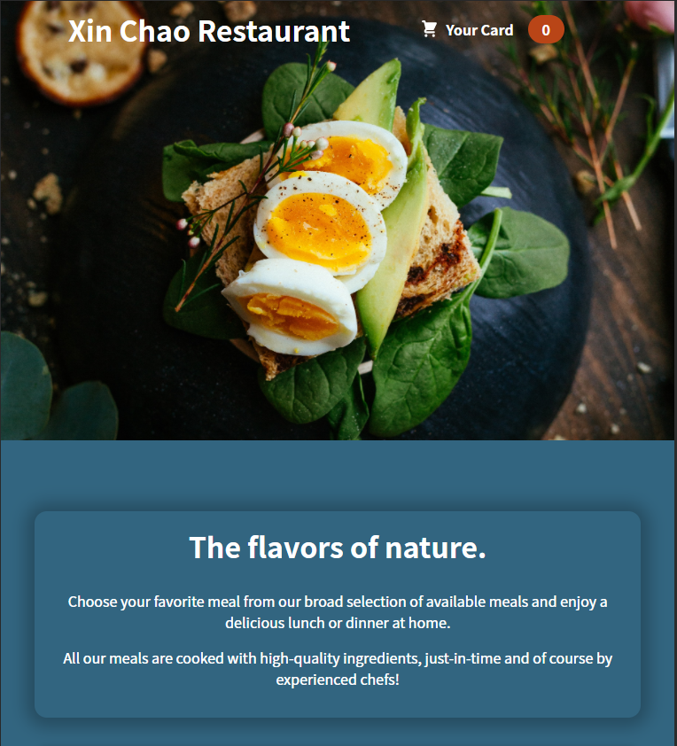
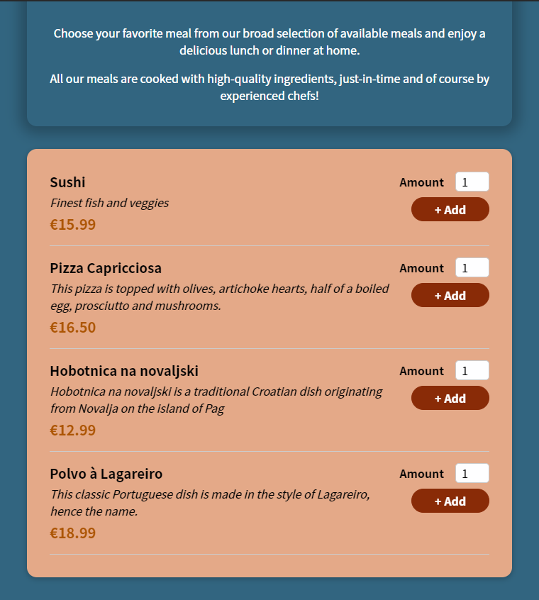
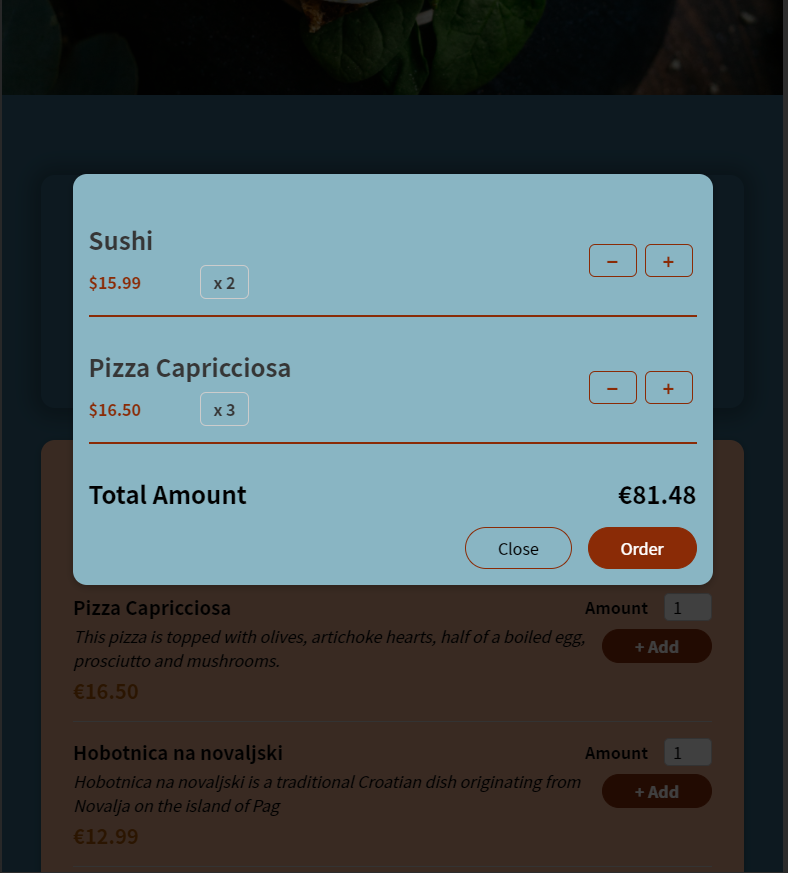

<p align="center">
  <p align="center">
    A website of Xin Chao Restaurant
    <br>
    Xin Chao Restaurant
  </p>
</p>


## Table of contents

- [Getting started](#getting-started)
- [What's included](#whats-included)
- [Creators](#creators)

## Getting started

Start by cloning the project and extract files. Then open bash or CLI, navigate to the folder contains the project and type

```
npm install
```

This is just an example application.

Start build the application by using command:

```
npm start
```

## Screen Shots

<p align="center">
  
</p>
<p align="center">
  
</p>
<p align="center">
  
</p>


## Creators

**Creator 1**

- <https://github.com/nguyenxuongkim2103>


Enjoy :metal:
